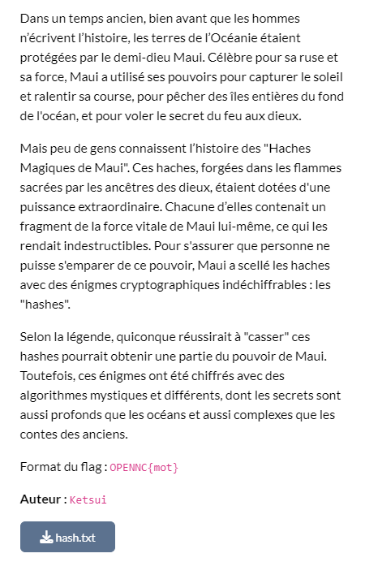

## Résolution

il faut casser chaque hash avec la méthode qui va bien qui est donné dans le fichier.

On peux soit utiliser des ressources en ligne pour casser les hashes. https://crackstation.net/ permet d’en décrypter quelques un mais pas tous. On comprends avec ça que chaque hash correspond à un caractère. Si c’est le cas, la solution du bruteforce est possible car pas très long pour tester toutes les possibilités.

Sinon on bruteforce pour chaque type de hash avec un script : 

```python
# on importe specifiquement les hash qui ne peuvent pas être chargé dans le import *  
from Crypto.Hash import BLAKE2s, BLAKE2b, SHA  
from Crypto.Hash import *  
  
# on défini la liste de caractères que l'on va tester pour le bruteforce  
data = '0123456789abcdefghijklmnopqrstuvwxyzABCDEFGHIJKLMNOPQRSTUVWXYZ!#$%&()*+,-./:;<=>?@[\]^_`{|}~ '  

# tableau avec les hash du fichier, on peux aussi lire depuis le fichier directement si besoin
hashes = ['SHA 08a914cde05039694ef0194d9ee79ff9a79dde33', 'SHA1 511993d3c99719e38a6779073019dacd7178ddb9',  
          'MD2 6bf156f1b6534f1ab59454344bd74c16', 'MD4 cf3dd8fdd65fb9a3ecbe43aa7d411d3f',  
          'MD4 cf3dd8fdd65fb9a3ecbe43aa7d411d3f',  
          'SHA3_256 2248e6be26f60c9baa59adbda2a136a4a5305d7b475d8465ba4911b4886e39a5',  
          'MD5 f95b70fdc3088560732a5ac135644506', 'SHA224 7e27c59a202f5e2b2b3b5458300140ef7aa7edc3a97a605b788546a1',  
          'SHA256 c3641f8544d7c02f3580b07c0f9887f0c6a27ff5ab1d4a3e29caf197cfc299ae',  
          'SHA384 1861ebe932dc65c5f04d33f6972b13acc8b1e572344016bf3cc950f60bfad6fdc0e32f0318e8bba57cf756eac0a49fce',  
          'SHA512 9032fb94055d4d14e42185bdff59642b98fe6073f68f29d394620c4e698a86fb2e51351ca6997e6a164aae0b871cf789fbc6e0d863733d05903b4eb11be58d9c',  
          'SHA3_224 d22e03747b83667e3e84c78e9fb49f7c9376334b9cb337addbdf3ff9',  
          'SHA3_256 2248e6be26f60c9baa59adbda2a136a4a5305d7b475d8465ba4911b4886e39a5',  
          'SHA3_384 d87826dc897a66ee657458dbbe788e473e809b47c93bb37902b74b53999ae64a0ecdc8f76b28b608c2bf66f836d1b8d9',  
          'SHA3_512 329fadd7c1d5f243d57af8a95da82235d2b846681d725e9eaf7095800fa66197144044622c79b37b9e501966e6a35a866ebf03d0b3033e446b993d3f5b193de3',  
          'TupleHash128 18a5ebd346c130b36329c21b666a2c4b3685a2b9010c33cc7b50c8e167dbd764f4d489ca8c2036dedc0cb7385ac03ed310ede3b71c8a790e2504c63cd22f21a8',  
          'TupleHash256 06a09af883dd316746247e3cee3de97dacc815e8ad40fdfb4e74a61137a54e6d75bbcab13f751e6f01d29b4f6ecdd52ed0abe03e910644d86f2db8d6920dc4e6',  
          'BLAKE2s 27988a0e51812297c77a433f635233346aee29a829dcf4f46e0f58f402c6cfcb',  
          'BLAKE2b 7ae26253cfd42a3a090c44023c234ec63d0ffe63f8ad40b7913f3f646503b7a7cb8ac571d42a311ef71508344de72f30b57e5c100b402130060ebc947e07a59b']

# on récupère toutes les lignes du fichier qui contient les HASH et leurs méthodes  
#with open('hash.txt', 'r') as f:  
#    hashes = f.readlines()  

# opération sur chaque ligne  
for line in hashes:  
    # On split la méthode et le digest  
    hash, digest = line.split()  
    # on doit passer des bits pour les méthodes de blake à la valeur maximale sinon ça ne se correspondra pas  
    if hash in ['BLAKE2s', 'BLAKE2b']:  
        options = 'digest_bits='  
        if hash[-1] == 's':  
            options += '256'  
        else:  
            options += '512'  
    else:  
        # pour les autre methodes pas d'option  
        options = ''  
    # et là on commence le bruteforce  
    for c in data:  
        # création de notre methode de hash  
        h_object = eval(f"{hash}.new({options})")  
        # on lui donne le caractère à hasher  
        h_object.update(c.encode())  
        # si notre digest correspond à celui du fichier on l'affiche  
        if h_object.hexdigest() == digest:  
            # end='' -> eviter les retour à la ligne après affichage du résultat  
            print(c, end='')  
            break
```


>[!question]- Spoiler du flag
> OPENNC{H@5H_C4SSE!}

