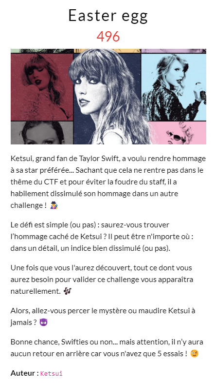

## Résolution

Indice dans le challenge [L'agence](../forensic/L'agence.md)

Pour trouver l’énoncé il faut aller voir les données en mémoire pour le notepad. Pour celà il faut utiliser **volatility2**. Il n’est pas simple à installer pour que ça fonctionne correctement.

Une autre façon de faire est de simplement utiliser la commande strings : `strings -e l kestui.vmem > strings.txt`. Il va récupérer toutes les strings et les mettre dans un fichier.
On fait une recherche sur `OPENNC` dans ce fichier et on tombe sur notre énoncé.
## Enoncé à trouver

>Durant 
>'s t5
>Swift a séjourné  dans différents palaces et hôtels.
>Dans une ville particulière nous avons pu voir apparaitre "TWIFTIES" dans le ciel, faisant référence au swifties et Travis Kelce.
Ta mission est de me donner le nom de cette ville, le nom de l'hotel où elle a séjourné et le numéro de l'étage de l'appartement.
Bonne chance Swiftie !
>format du flag : OPENNC{Pays_Hotel_10}

>[!question]- Spoiler du flag
> OPENNC{}

